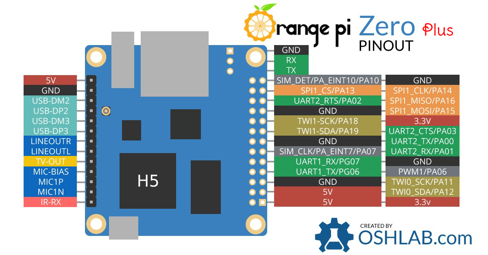
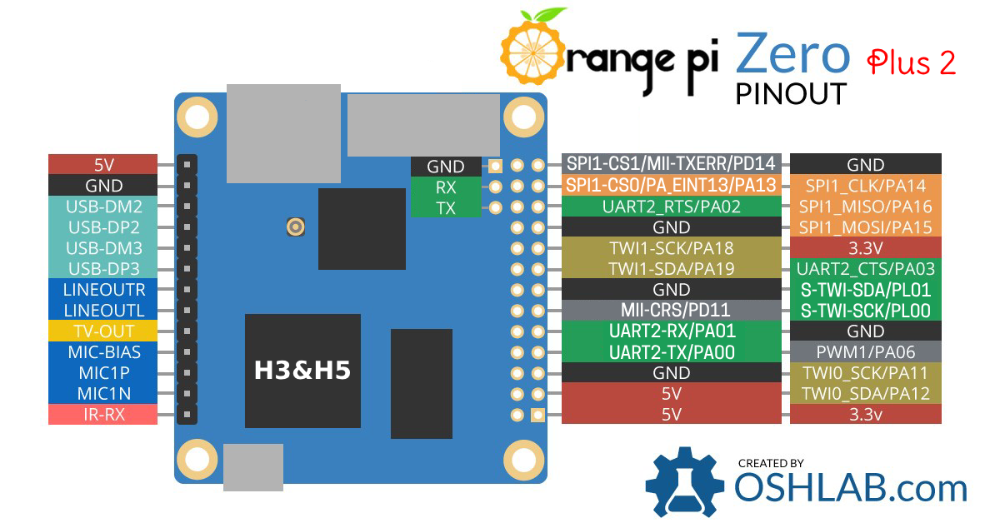

# ESP32 Reference

## Usage
### Firmware
- Pre-compiled binary firmware files are in folder `firmware`.
    - boot_app0.bin
    - bootloader.bin
    - default.bin
    - ESP32_Sandbox.ino.bin

- Or you can compile from source code in `src` with `ESP-IDF` and `arduino-esp32`.
    1. Setup [ESP-IDF](https://github.com/espressif/esp-idf) as described in its page (example on Debian).
    ```bash
    # 1.1 install compiler(toolchain)
    sudo apt-get install gcc git wget make libncurses-dev flex bison gperf python python-serial
    wget https://dl.espressif.com/dl/xtensa-esp32-elf-linux64-1.22.0-80-g6c4433a-5.2.0.tar.gz -O xtensa-esp32.tar.gz
    tar -xvzf xtensa-esp32.tar.gz
    # 1.2 set toolchains path in environment
    echo PATH="\$PATH:$(pwd)/xtensa-esp32-elf/bin" ~/.profile
    # 1.3 get and config ESP-IDF(headers and libs)
    git clone --recursive https://github.com/espressif/esp-idf.git
    cd esp-idf && git submodule update --init --recursive
    echo IDF_PATH=$(pwd) >> ~/.profile
    ```

    2. Setup [arduino-esp32](https://github.com/espressif/arduino-esp32) as one of `ESP-IDF` components.
    ```bash
    # 2.1 setup arduino-esp32
    cd ${IDF_PATH}/examples && mkdir arduino-core && cd arduino-core
    mkdir -p components && cd components && \
    git clone https://github.com/espressif/arduino-esp32.git arduino && \
    cd arduino && git submodule update --init --recursive && cd ../..
    # 2.2 create a new project folder
    MyProjectName=esp32-embci
    mkdir -p ${MyProjectName}/main && cd ${MyProjectName}
    sed 's/blink/${MyProjectName}.ino/g' "../../get-started/blink/Makefile" > Makefile
    ln -s ../components components
    echo "#include <Arduino.h>" > main/main.cpp
    ```

    3. Then compile with command `make menuconfig && make all`.
    ```bash
    # 3.1 add access to source file
    rm -rf main
    ln -s ${EMBCI_PATH}/files/esp32/src ./main
    # 3.2 remember to tick on "Autostart Arduino setup and loop on boot"
    make menuconfig && make all
    # 3.3 copy generated binary files into folder `firmware`
    ln -s ${EMBCI_PATH}/files/esp32/firmware ./firmware
    cd build
    cp ota_data_initial.bin ../firmware/boot_app0.bin
    cp bootloader/bootloader.bin ESP32_Sandbox.ino.bin default.bin ../firmware/
    ```

## Flash firmware
Use script `EmBCI/tools/esptool.py` or simply type command `make flash` to write binary files into on-shield ESP32. Use `sudo` if needed.


## ESP32 serial monitor
```bash
miniterm.py /dev/ttyS1 115200
# or
screen /dev/ttyS1 115200
# Change port to `/dev/ttyS2` on OPi0+2. Or use our simple Makefile.
make monitor
```
or any other serial monitor.

### Command Interface (Deprecated in v0.1.4)
Example output of serial.
```
ESP32 Firmware XXXX.XX-EmBCI
Board:  OrangePi Zero Plus [2]
Shield: EmBCI Rev.XX XXX XX XXXX
Booting...
...
Press `h` for help message
...
Supported commands:
    h - print this Help message
    c - Clear spi fifo queue
    d - change esp output Data source
    m - be less verbose (Mute)
    s - print Summary of current status
    v - be more Verbose
    w - turn on/off serial-to-Wifi redirection
```

### Console-like Interface (Added in v0.1.5)
Example output of serial.
```
--- Miniterm on /dev/ttyUSB0  115200,8,N,1 ---
--- Quit: Ctrl+] | Menu: Ctrl+T | Help: Ctrl+T followed by Ctrl+H ---
rst:0x1 (POWERON_RESET),boot:0x13 (SPI_FAST_FLASH_BOOT)
...
E (30) EmBCI: IDF Version: v3.2-dev-1385-g129d327
E (30) EmBCI: Chip info:
E (30) EmBCI: 	model: ESP32
E (30) EmBCI: 	cores: 2
E (40) EmBCI: 	feature: /802.11bgn/BLE/BT/External-Flash: 4 MB
E (40) EmBCI: 	revision number: 1
E (50) EmBCI: Firmware Version: 2019.4-EmBCI
E (50) EmBCI: ARM Board: OrangePi Zero Plus 2
E (50) EmBCI: EmBCI Shield: EmBCI Rev.B1 Apr 12 2019
...
I (1220) EmBCI: Type `help` for commands message
EmBCI> help
help
  Print the list of registered commands

sample_rate  [-r <0-6|250|500|1k|2k|4k|8k|16k>]
  Print or set ADS1299 sample rate
  -r, --rate=<0-6|250|500|1k|2k|4k|8k|16k>  specify sample rate (250-16000) or its index (0-6)

input_source  [-s <0-5|Normal|BIAS|Shorted|MVDD|Temperature|Test>] [-c <0-7>]
  Print or set ADS1299 data source
  -s, --source=<0-5|Normal|BIAS|Shorted|MVDD|Temperature|Test>  specify source name or its index (0-5)
  -c, --channel=<0-7>  specify channel number, default all

bias  [<on|off>] [-c <0-7>]
  Print or set ADS1299 BIAS output state
      <on|off>  action can also be <true|false>
  -c, --channel=<0-7>  specify channel number, default all

impedance  [<on|off>] [-c <0-7>]
  Print or set ADS1299 impedance measurement
      <on|off>  action can also be <true|false>
  -c, --channel=<0-7>  specify channel number, default all

sleep  [-t <t>] [-p <n>]... [-l <0|1>]... [--method=<light/deep>]
  Turn ESP32 into light/deep sleep mode
  -t, --time=<t>  wakeup time, ms
  -p, --gpio=<n>  If specified, wakeup using GPIO with given number
  -l, --level=<0|1>  GPIO level to trigger wakeup
  --method=<light/deep>  sleep method

...

summary
  Print summary of current status

tasks
  Get information about running RTOS tasks
```


## Pin-out
On-shield `ESP32-WROOM-32` connection with `OrangePi Zero Plus(2)` listed as follows.

### Connection
| ESP32 | OPi0+ | OPi0+2 |
| -     | -     | -      |
| EN    | PA19  | PA19   |
| BOOT  | PA18  | PA18   |
| DRDY  | PA07  | PD11   |
| UART0 | UART1 | UART2  |
| UART1 | UART2 | ------ |
| HSPI  | SPI1  | SPI1   |

### OPi0+ Pin Number
| num  | UART1     | UART2     | SPI1                 |
| -    | -         | -         | -                    |
| GPIO | T198 R199 | T0   R1   | CS13 CLK14 MO15 MI16 |
| PIN  | PG06 PG07 | PA00 PA01 | PA13 PA14  PA15 PA16 |



### OPi0+2 Pin Number
| num  | UART2     | SPI1                 |
| -    | -         | -                    |
| GPIO | T0   R1   | CS13 CLK14 MO15 MI16 |
| PIN  | PA00 PA01 | PA13 PA14  PA15 PA16 |



### ESP32 Pin Number
| num  | EN | BOOT | DRDY | UART0 | UART1  | HSPI                 |
| -    | -  | -    | -    | -     | -      | -                    |
| GPIO | -- | 0    | 4    | T1 R3 | T10 R9 | CS15 CLK14 MI12 MO13 |
| PIN  | 3  | 25   | 26   | 35 34 | 18  17 | CS23 CLK13 MI14 MO16 |


