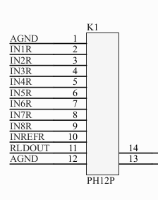

# EmBCI Shield

## Amplifier Pinout

## Board Connection
- Communicate with [ADS1299](http://www.ti.com/product/ADS1299) through SPI
interface on OrangePi pin `CS/PA13`, `CLK/PA14`, `MOSI/PA15` and `MISO/PA16`

- On shield Atmega328P(Arduino Uno/Nano) connects to OrangePi by `UART2_TX/PA00`
and `UART2_RX/PA01`. **Deprecated**

- On shield ESP32 is used as Data Buffer to cache raw data from ADS1299 and send
out preprocessed data chunk by chunk as SPI slave. Benefit from ESP32's precise
clock cycle and rich calculation resource, many important IO features are
implemented.

- Control SSD1306 0.96' OLED screen by SPI or ILI9325 2.3' LCD screen through
on shield Arduino by serial. **Deprecated**

- EmBCI broadcasts collected biosignal data by two ways: Lab-streaming-layer and TCP Server. Before you fetch data through network, make sure that your device and EmBCI machine are in a same local network. You can create a hotspot for EmBCI or login your device to the hotspots created by it.

## Electrodes
Passive electrodes have no inbuit circuitry. You may need paste/gel between it and subject's skin/scalp for better signal. Electrodes can be round or needle metal things coated with special alloys, for example gold, tin and silver. Ag / AgCl are supposed to be best.

Comparing to passive electrodes, active electrodes work by putting a unity-gain amplifier right next to the electrode up on the scalp. This greatly improves the signal quality and avoids the skin preparation like conductive paste and gel.

A brief history of active eletrodes:
- Jarek Foltynski created the initial designs and prototypes. [link](http://bioera.net/ae/)
- Joerg Hansmann refined the v2 circuit design.
- Ian Vincent introduced the idea of using multiple-pin electrodes which can pass through the hair easily.
- Joe Street created a modified design using power cells instead of requiring power from ADC board. [link](http://openeeg.sourceforge.net/doc/hw/joe_ae/)
- Jim Peters constructed a version of Joerg's design. [link](http://uazu.net/eeg/ae.html)
- Pedro Ortega created a simplified version without the shielding/guarding. [link](http://www.dcc.uchile.cl/~peortega/ae/)
